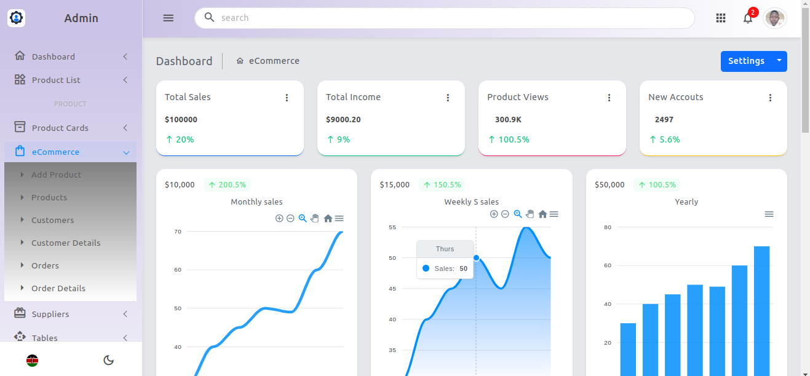

# eCommerce Admin Dashboard

This is a **React-based eCommerce Admin Dashboard** designed to streamline the management of an online store. The dashboard provides admins with tools to monitor and analyze key business metrics, such as **profit analysis** through interactive charts, as well as features for managing products, orders, and customers.

## Features

- **Dashboard Overview**: Access key metrics for a quick view of business health.
- **Profit Analysis**: Visual charts display profit trends over time.
- **Orders Management**: View, filter, and manage customer orders.
- **Product Management**: Add, edit, or delete product details.
- **Customer Management**: View customer profiles and purchase history.
- **Notifications**: Real-time notifications for new orders and low stock alerts.

## Installation

To get started with the eCommerce Admin Dashboard, follow these steps:

1. Clone the repository:

   ```bash
   git clone https://github.com/EsbonMigiro/react-ecommerce-admin
   ```

2. Navigate into the project directory:

   ```bash
   cd ecommerce-admin-dashboard
   ```

3. Install the dependencies:

   ```bash
   npm install
   ```

4. Start the development server:

   ```bash
   npm start
   ```

5. Open your browser and navigate to `http://localhost:3000` to view the dashboard.

## Usage

- Log in using your admin credentials.
- Navigate through different sections using the sidebar.
- View and analyze profit trends in the Profit Analysis section.
- Manage products, orders, and customers from their respective sections.

## Contributing

If you would like to contribute to this project, please fork the repository and create a pull request with your changes.
